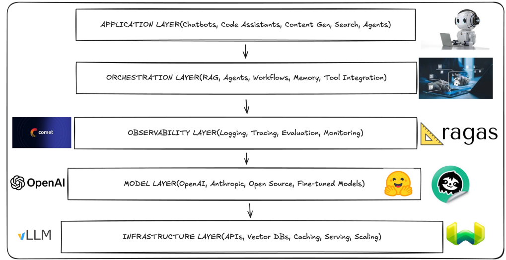
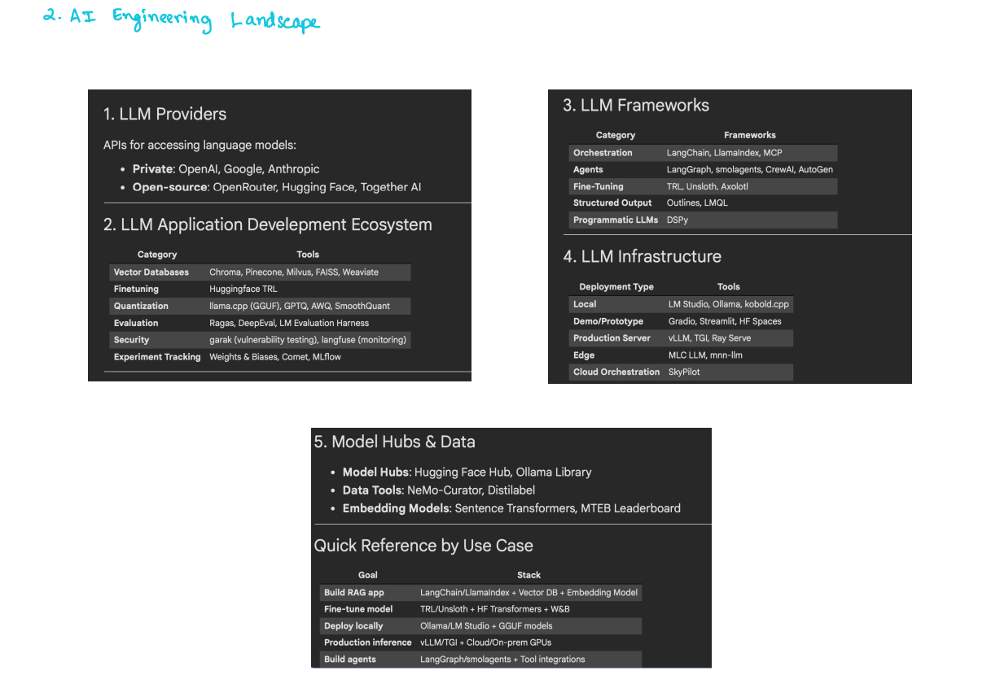

---

#  Introduction to AI Engineering – Class 1 Notes

---

# 1️⃣ What is LLM?

##  Definition

**LLM = Large Language Model**

A Large Language Model is a deep learning model trained on a massive amount of textual data to understand and generate human-like text.

---

## 🔹 Breaking the Term

### 1. Large

* Billions of parameters
* Trained on internet-scale data

**Parameter** = A weight in the neural network that the model learns during training.

---

### 2. Language

The model works on:

* Text
* Code
* Documents
* Conversations

---

### 3. Model

A mathematical function that maps:

```
Input text → Predicted next token
```

LLMs work by predicting the **next token**.

---

## 🔹 What is a Token?

A token is:

* A word
* Part of a word
* Or punctuation

Example:

```
"I love AI"
```

Tokens might be:

```
["I", " love", " AI"]
```

---

##  How LLMs Work (Basic Intuition)

LLMs are based on:

```
Transformer Architecture
```

Key concept: **Self-Attention**

### What is Self-Attention?

It allows a word to look at other words in the sentence and decide which ones matter more.

Example:

> "The animal didn’t cross the road because it was too tired."

The word "it" attends more to "animal" than "road".

---

# 2️⃣ Traditional ML Engineering vs AI Engineering

---

##  Traditional ML Engineering


1. Collect custom dataset
2. Clean data
3. Feature engineer
4. Train model from scratch
5. Deploy

Example:

* Spam classifier
* Fraud detection

You build everything.

---

##  AI Engineering (Modern Approach)


* Use pre-trained foundation models
* Build applications on top of them
* Focus on integration + orchestration

You don’t train from scratch.
You build on powerful models like GPT.

---

# 3️⃣ What is AI Engineering?

AI Engineering = Building production-grade applications powered by foundation models.

---

##  What is a Production Application?

An app used by real users.

Example:

* ChatGPT
* GitHub Copilot
* AI customer support bot

Production means:

* Real users
* Scalable
* Reliable
* Safe
* Cost-efficient

---

# 4️⃣ Foundation Models

Foundation models are large pre-trained models that can be adapted for many tasks.

Types:

| Type       | Example          |
| ---------- | ---------------- |
| LLM        | GPT              |
| Diffusion  | Stable Diffusion |
| Multimodal | GPT-4 Vision     |

---

# 5️⃣ AI Engineering Focus Areas

AI engineering emphasizes:

---

## 1️⃣ Integration of Pre-Trained Models

Instead of training:

```python
from openai import OpenAI
client = OpenAI()

response = client.chat.completions.create(
    model="gpt-4o-mini",
    messages=[{"role": "user", "content": "Explain AI engineering"}]
)

print(response.choices[0].message.content)
```

---

###  Code Explanation Line by Line

```python
from openai import OpenAI
```

* `from` → import keyword
* `openai` → library
* `OpenAI` → class inside library

---

```python
client = OpenAI()
```

* Creating object
* `client` → instance of OpenAI class
* This allows API calls

---

```python
response = client.chat.completions.create(
```

* `client` → object
* `chat` → chat endpoint
* `completions` → generates response
* `create()` → method call

---

```python
model="gpt-4o-mini",
```

Specifies which model to use.

---

```python
messages=[{"role": "user", "content": "Explain AI engineering"}]
```

* `messages` → list
* `role` → who is speaking
* `content` → message text

---

```python
print(response.choices[0].message.content)
```

* `response.choices` → list of outputs
* `[0]` → first response
* `.message.content` → actual text

---

## 2️⃣ Prompt Design & Optimization

Prompt = Instructions given to LLM.

Bad Prompt:

```
Explain ML
```

Better Prompt:

```
Explain machine learning in 3 bullet points for a beginner.
```

Prompt Engineering = Designing better instructions.

---

## 3️⃣ Orchestration (RAG, Agents, Workflows)

---

### What is RAG?

RAG = Retrieval Augmented Generation

Problem:
LLM doesn’t know your private data.

Solution:

1. Convert documents → embeddings
2. Store in vector DB
3. Retrieve relevant chunks
4. Give to LLM

---

### Embeddings

Embedding = Numeric vector representation of text.

Example:

```
"AI is powerful" → [0.12, -0.45, 0.89, ...]
```

---

### Vector Database

Stores embeddings.

Examples:

* Pinecone
* Chroma
* Weaviate

---

### Example Code for Embeddings

```python
from openai import OpenAI

client = OpenAI()

embedding = client.embeddings.create(
    model="text-embedding-3-small",
    input="AI is powerful"
)

print(len(embedding.data[0].embedding))
```

---

### Code Explanation

* `embeddings.create()` → creates vector
* `model` → embedding model
* `input` → text to convert
* `embedding.data[0].embedding` → actual vector

---

## 4️⃣ Evaluation & Observability

---

### Evaluation

How good is model output?

Methods:

* Human evaluation
* Automated metrics
* RAGAS

---

### Observability

Tracking:

* Logs
* Latency
* Failures
* Cost

---

## Comet – LLM Tracking Pipeline

Comet tracks:

* Experiments
* Prompts
* Responses
* Metrics

Example:

```python
import comet_ml

experiment = comet_ml.Experiment(
    api_key="your_api_key",
    project_name="ai-engineering"
)

experiment.log_metric("accuracy", 0.92)
```

---

# 6️⃣ LLM Frameworks

Framework = Tool that helps build apps faster.

Examples:

| Category          | Tools     |
| ----------------- | --------- |
| Orchestration     | LangChain |
| Agents            | LangGraph |
| Fine-tuning       | TRL       |
| Structured Output | LLMQL     |

---

# 7️⃣ AI Agents

Agent = LLM + Memory + Tools + Decision Logic

Instead of just answering,
Agent can:

* Search
* Call APIs
* Use calculator
* Make decisions

---

# 8️⃣ LLM Infrastructure

Infrastructure = How model runs in production.

Includes:

* APIs
* Vector DB
* Caching
* Scaling
* GPUs

---

## Deployment Types

### Local

Run on your machine

Example:

```
Ollama
```

---

### Production Server

Tools:

* vLLM
* TGI
* Ray Serve

---

# 9️⃣ Quantization

---

## What is Quantization?

Reducing numerical precision of model weights.

Example:

Before:

```
float32 (32-bit precision)
```

After:

```
int8 (8-bit precision)
```

---

## Why Do We Do It?

* Reduce memory
* Faster inference
* Lower cost
* Run on smaller GPUs

---

### Example

If model is 16GB in float32,
after quantization it may become 4GB.

---

# 🔟 AI Engineering Stack (From Image)

---

## Layer 1: Application Layer

* Chatbots
* Code assistants
* Search systems

---

## Layer 2: Orchestration Layer

Handles:

* RAG
* Agents
* Memory
* Tool calling

---

## Layer 3: Observability Layer

Handles:

* Logging
* Tracing
* Evaluation

---

## Layer 4: Model Layer

Where models live:

* OpenAI
* Anthropic
* Open-source models

---

## Layer 5: Infrastructure Layer

Handles:

* APIs
* GPUs
* Scaling
* Vector DB

---

