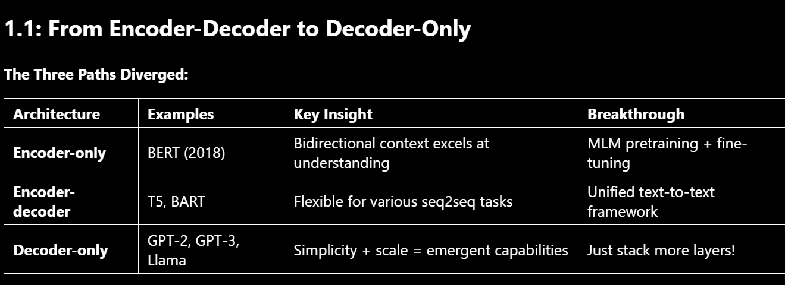
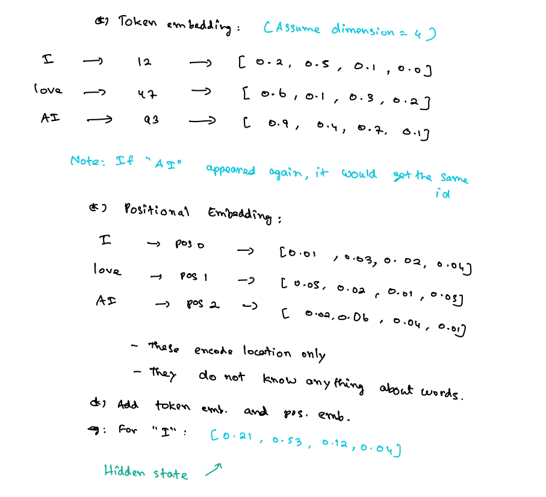
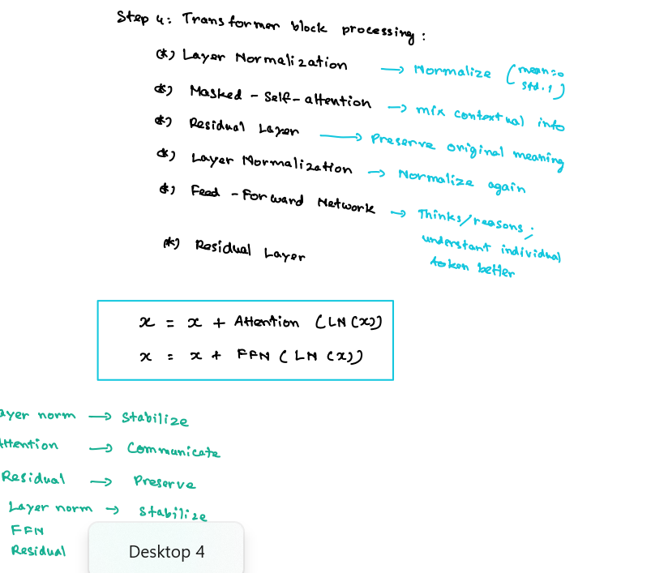

---------------------------------------
-----------------------------------
--------------------------------
-------------------------
----------------------


---

#  Journey to Modern LLMs

---

# 1️⃣ Introduction: Journey to Modern LLMs

The modern Large Language Models (LLMs) evolved from the **Transformer architecture**, introduced in:

>  2017 – *“Attention Is All You Need”* (Google)

 this paper introduced:

* Transformers
* Sequence-to-sequence modeling
* Attention mechanism

---

# 2️⃣ From Encoder–Decoder to Decoder-Only

---

## 2.1 Sequence-to-Sequence (Seq2Seq)

Transformer was originally built for:

```
Sequence → Sequence tasks
```

Example:

* Translation
* Summarization

Input: English sentence
Output: French sentence

---

## 2.2 Transformer Architecture

Transformer has **two components**:

```
Encoder → Reader
Decoder → Writer / Generator
```


### 🔹 Encoder

* Uses **Bidirectional Attention**
* Reads entire input
* Creates contextual representation

### 🔹 Decoder

* Uses **Causal Attention**
* Generates token by token
* Uses **Cross-Attention** to attend encoder output

---

# 3️⃣ What is Attention?

### Definition:

Attention is the mechanism that lets a token decide how much importance to give to other tokens.

Think:

Each word asks:

> "Which other words are important for understanding me?"

---

### Example

"I deposited money in the bank."

"Bank" could mean:

* Financial institution
* River bank

Attention helps determine meaning from context.

---

# 4️⃣ Encoder vs Decoder Attention

| Component | Type of Attention | Why?                           |
| --------- | ----------------- | ------------------------------ |
| Encoder   | Bidirectional     | Can see past and future tokens |
| Decoder   | Causal            | Can only see previous tokens   |

---

## 4.1 Bidirectional Attention

Each token looks at:

* Tokens before it
* Tokens after it

Used in:

* BERT

---

## 4.2 Causal Attention

Each token looks only at:

* Tokens before it

Why?

Because during generation:
You don’t know future words.

---

# 5️⃣ The Decoder-Only Revolution


### 2019 → GPT-2

* Removed encoder
* Only decoder stack
* Predicts next token
* Multi-task without fine-tuning

---

## Why Decoder-Only Won?

### 1️⃣ Training Simplicity

Train model as:

[
P(x_t | x_1, x_2, ..., x_{t-1})
]

This is next-token prediction.

Same training and inference objective.

---

### 2️⃣ Better Scaling

Just stack more decoder blocks.

More data + more parameters = better performance.

---

### 3️⃣ Emergent Abilities

At scale:

* Few-shot learning
* Zero-shot transfer
* Reasoning emerges

GPT-3 solidified decoder-only dominance.

---

# 6️⃣ Decoder-Only Architecture (Foundation)


## Core Principle

Stack multiple transformer decoder blocks.

Each block processes:

```
Left → Right (Causal Attention)
```

---

# 7️⃣ Data Flow Through Decoder-Only Model

Now we study how tokens move from input → output.

---

# Step 1️⃣ Tokenization

Purpose:
Convert text → integers.

---

## Example

Sentence:

```
I love AI
```

Token IDs:

```
I → 12
love → 47
AI → 93
```

These are vocabulary indices.

---

## GPT-2 Vocabulary

* 50,257 tokens
* Uses Byte Pair Encoding (BPE)

## LLaMA 3.1

* ~128k tokens

---

### What Does Vocabulary Size Mean?

If GPT-2 says it has 50k tokens,
It means it knows 50k possible subword units.

We speak in words.
Model speaks in tokens.

---

### Example: "unbelievable"

Could split as:

```
un + believable
```

or

```
un + believ + able
```

Larger vocabulary = bigger fragments.

---

# Step 2️⃣ Embedding Lookup

Token → Token ID → Vector

Each token ID maps to a vector.

---

## GPT-2 Specs

* Embedding dimension = 768
* Vocabulary size = 50,257

Embedding Matrix shape:

```
(50257, 768)
```

Each row:
= One vocabulary token vector.

---

## Example (Simplified Dim = 4)

Token embeddings:

```
I    → [0.2, 0.5, 0.1, 0.0]
love → [0.6, 0.1, 0.3, 0.2]
AI   → [0.9, 0.4, 0.7, 0.1]
```

Important:
If AI appears again → same token ID → same embedding.

---

# Step 3️⃣ Positional Embeddings

Problem:

Self-attention doesn’t know order.

Solution:

Add positional embeddings.

GPT-2 uses:

* Learned absolute positions
* Max position = 1024

---

## How Do We Add Position?

We add:

```
Token Embedding + Position Embedding
```

Example:

```
I → Token vector + Position(0) vector
```

Must be same dimension.

---

## Hidden State

After adding:

```
Hidden State = Token Embedding + Positional Embedding
```

This is the input to transformer block.

---

# Step 4️⃣ Transformer Block


Each block contains:

1. Layer Norm
2. Masked Self-Attention
3. Residual Connection
4. Layer Norm
5. Feed Forward Network
6. Residual

---

## 4.1 Layer Normalization

Normalizes:

Mean = 0
Std = 1

Why?

* Stabilizes training
* Keeps values in similar scale

---

## 4.2 Masked Self-Attention

Also called:
Causal Attention

It mixes contextual information.

---

## 4.3 Residual Connection

Formula:

[
X = X + Attention(LN(X))
]

Why?

To preserve original meaning.
If attention fails, original info remains.

---

## 4.4 Feed Forward Network (FFN)

Each token processed independently.

Think of it as:

"Token-level reasoning layer"

---

# 8️⃣ Self-Attention Deep Dive

Each token asks:

> Which other tokens are important for me?

---

## Q, K, V


Query (Q):

* What am I looking for?

Key (K):

* What do I contain?

Value (V):

* What information do I provide?

---

## How Are Q, K, V Created?

From hidden state X:

[
Q = W_Q X
]
[
K = W_K X
]
[
V = W_V X
]

Where:

* W_Q, W_K, W_V = learned weight matrices

---

## Attention Formula

[
Attention(Q,K,V) = softmax\left(\frac{QK^T}{\sqrt{d_k}}\right)V
]

---

### Explanation

### QKᵀ

Dot product → measures similarity.

Higher value → more attention.

---

### √dₖ Scaling

Prevents values from becoming too large when dimension increases.

---

### Softmax

Converts scores into probabilities.

---

### Multiply by V

Applies attention weights to actual content.

---

# 9️⃣ Multi-Head Attention

GPT-2 Small Specs:

* Embedding dim = 768
* Attention heads = 12
* Head dimension = 64

[
768 / 12 = 64
]

Each head captures:

* Syntax
* Subject-verb relation
* Semantic similarity

---

# 🔟 Why Decoder-Only Works for Everything

Because every task can be framed as:

```
Next Token Prediction
```

Example:

QA:

```
Question: ...
Answer:
```

Summarization:

```
Summarize: ...
```

Translation:

```
Translate English to French: ...
```

All become text completion.

---

# 1️⃣1️⃣ Training = Inference

Training:

[
P(x_t | x_1, ..., x_{t-1})
]

Inference:

Generate one token at a time.

Same architecture.
No special decoding mode.

---

# 1️⃣2️⃣ Example Code (Like in ipynb)

---

## Tokenization Example (HuggingFace)

```python
from transformers import AutoTokenizer

tokenizer = AutoTokenizer.from_pretrained("gpt2")

text = "I love AI"

tokens = tokenizer(text)
print(tokens)
```

### Explanation

* `AutoTokenizer` → loads tokenizer
* `from_pretrained("gpt2")` → loads GPT-2 vocabulary
* `tokenizer(text)` → converts text → token IDs

---

## Attention Demonstration (Conceptual)

```python
import torch
import torch.nn.functional as F

Q = torch.rand(3, 4)
K = torch.rand(3, 4)
V = torch.rand(3, 4)

scores = torch.matmul(Q, K.T) / torch.sqrt(torch.tensor(4.0))
weights = F.softmax(scores, dim=-1)
output = torch.matmul(weights, V)

print(output)
```

---

### Line-by-Line Explanation

`torch.rand(3,4)` → random matrix

`matmul(Q, K.T)` → dot product similarity

`/ sqrt(d_k)` → scaling

`softmax` → attention probabilities

`weights @ V` → weighted content

---


---------------
------------------
------------------
---------------


Introduction to journey to modern LLMS
1.1 from Encoder-decoder  to decoder only
=>
2017 google launched the paper called attention is all you need
this paper proposed the architecutre known as transformers.
they have launched these transformers model mainly for the usecase called as sequence to sequence.
that means you give sequence as input and get sequence as output .

this transformer model has mainly two components
1. encoder  
its a reader
2. decoder 
its a writer or generator

task of encoder is to understand
task of decoder is to generate 
this transformer has a key mechanism and that key mechanism is called as attention 
attention is the core component of the transformer model 
and thats why the paper is also named as attention is all you need .

what is meant by attention ?
=> attention is the mechanism that lets the token decide how much importance we should give to other tokens .

Encoder uses bidirection attention. 
2. procces entire input 
3. create contextual representation.

Decoder :
1. causal attention : a decoder can only look at the token that are present before a particualr word or token.
2. generate output token by token
3. attends to encoder output cross-attention


from encoder decoder to decoder only 

the three paths diverged :



most of the LLM that we see today follows the decoder-only 
so... here comes the decoder only revolution 
advantage is 
1. 2019 -> GPT -2 - decoder-only architecture 
2. predicts next token .
3. multiple tasks without finetuning eg : QA , summarization. 


advantage of decoder only approach
1. training simplicity 
2. better scaling
3. emergent abilities

GPT-3 solidifies -> decoder only architecture


------------------

decoder-only -foundation.
1.1 decoder-only  architecture fundamentals.
core principle of decoder only model is that stack these transformermer decoder blocks that processes sequences left to right with causal attention.
1.2 data flow through the model :
how tokens move from input to output.
step1 : tokenization :
here the purpose of tokenization is to convert text into integers.
eg : GPT2  uses byte-pair encoding gpt-2 model has 50,257 tokens and Llama 3.1 has 128k tokens 
what this numbers means is , i know 1000 words in english the models way of saying is GPT-2 will say that i know 50272 tokens think tokens as individual unit a model can understand . we speak words , the model speaks in term of tokens .
advantage of having this longer vocabulary is that large fragments.
lets say there is a word unbelivable 

step 2: embedding lookup : 
token -> token id -> vector-embedding 

gpt-2 => embedding dimension of 756 .
embedding matrix
lets say we have gpt-2 and this gpt-2 has 50257 token-ids and each tokenids will have 768 values this is what an embedding matrix is it will be of the shape (50257,768). in this the rows represent the tokens and the column represent the dimension of each row .
- one 768-dimension row represent one vocaboulary token. 
this is called token embedding .

step 3 : positional infromation :
we dont know which token comes where we dont have positional information.
for this we will create positional embedding  and we are going to add this in the token embedding that we have alreay created .
now gpt2 uses what we know learned absolute postions .
-position limit will be 1024. (it means gpt2 at once can remember the position of 1024 tokens)

now the question is how will you add these position and token embeddings 

i    -> pos 0                                       [.........]1*756
love -> pos 1             + token embeddings        [.........]2*756
Ai   -> pos 2                                       [.........]1*756

now you can represent the positional embedding in terms of integers  and expect to add these token embeddings that you have created we will do position vector plus token vector


in tokenization we have words into token ids 
note if the word repeats then it gets the same token id 

next step is getting the postional embeddings 

what is hidden state : when you see  ... this term  its when we kind represent the word in terms of token embedding and positional embedding . 



first thing we have is layer normalization 
eg : for normal distribution the mean is 0 and the std is 1.
we do normalization in general to scale it evenly . (we want the data to be in similar scale  )
now next is masked attention. which is same is causal attention now the question is why do you need the causal attention here  its used to mix contextual information 
next part is residual layer -> when we add the self attention to this vector , its like adding inforamtion from some other token as well to get the contexttual meaning but we also make sure that if something goes wrong with this attention , we also want to make sure that the original meaning of this word is not lost . 
so this residual layer is going to preserver the original meaning of those individual tokens.
we again put this through the layer of normalization 
next we will have the feed-forward network. this feed forward network -> thinks/reasons / understand individual token better. then again next we will have the residual layer 


lets recap 
we discussed the paper attention is all you need .. they talked about transformers . it was initially used for sequence to sequence problems eg : translation 
and there are two components that are present inside the transformers that is encoder and then we have a decoder .. encoder wrties and understands the language decoder is the writer or the generator . then we saw the defination of attention. 
encoder would have a bidirection attention, that means a single token can look at the token previously and the token after that , it processes the entire input and creates the contextual representation.
and the decoder instead of having bi directional attention it uses causalattention that means it can only look at the previous tokens .but it also has cross attention that means it kind of looks at the encoder output .. but in the case of decoder only approaches we dont have this encoder only path . if we dont have the encoder .. there is no cross attention to work on . 
and then the decoder only revolution came with gpt 2  and it predicts the next token and the advantage is that any usecase can be considered as next token generation. and then discussed about the architecture train it same as inference and the result is zero-shot task transfer.

then we discussed its advantages and then we discussed the data flow ...


now we will talk about the selft attention 
in self attention each tokens ask , which other tokens in the sentence are important to me so that I can understant myself better. it defines what weigtage we should gove to individual attention .

so in self attention we have 
Query (Q) => what am i looking for ?
key (k) => what do I contain ?
value (v) => what information do I provide ?


