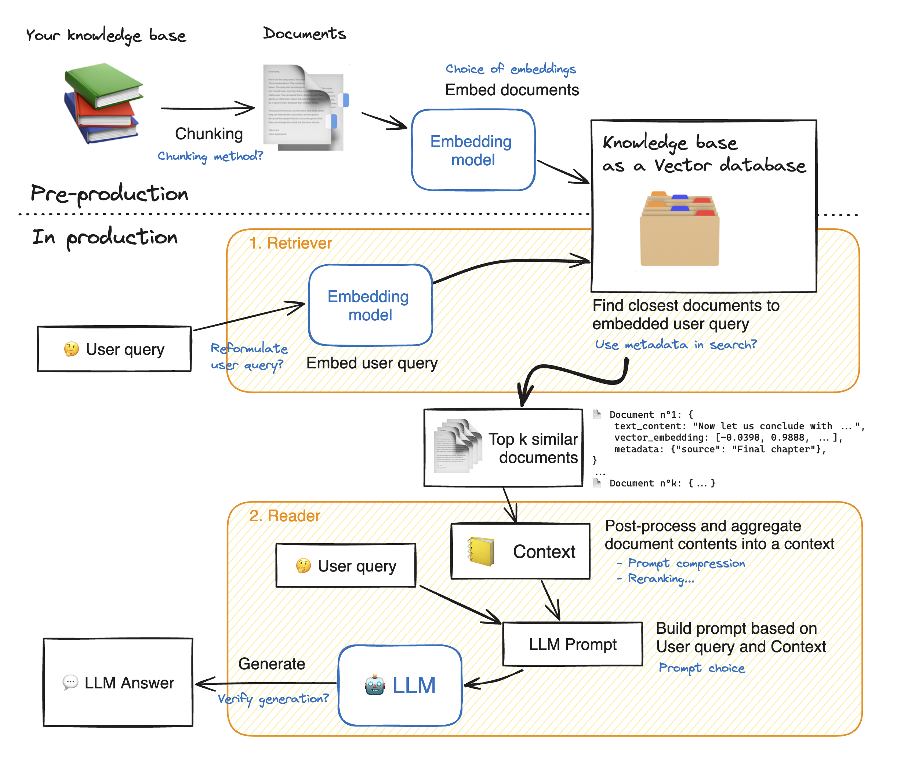

RAG

here in RAG we have pre production and in prodcution and the other way to look at this is document ingetion and inference 
document ingestion is when we take the knowledge source , we process it , save it in a vector database and inference is where we ask a question give a related context and pass it to llm 
these are the two stages .
first we have the knowledge base it can be a set of documents , set of pdfs 
so first we chunk it basically we seperate it into smaller piece of text and these chunks are later passed on to the embeding model, now this embedding model converts this chunks into vector embeddings and store this into the vector database .
Once we have this vectors in the database when a new user query comes we use the same embedding model , convert this into the query vector and pass this to the vector database and for this query vector what are all the related chunks , so we retrive this chunks in the text format , we identify the top chunks pass it as a context , to the llm and the llm would now answer the questions.

in google colab for chunking we have installed thie chonkie library .

we will understand the different chunking strategies and how it works 
we will also load the documents from hugging face 

what is chunking ?
it is splititng large documents into smaller pieces called chunks

why chunking matter ?
poor chunks  -> poor retrival 
problems :
too large : -> multiple ideas mixed , retrival becomes noises 
too small : -> missing context, hard to understand alone 

lets discuss about the different chunking strategies that we can follow here 
we have 
1. fixed size chunking
2. chunking with overlap
3. semantic chunking
4. recursive chunking
5. late chunking
6. LLM based agentic chunking

1. fixed size chunking :=>
here we split text using exact token size .
charactertics :
same chunk size 
problem : may break sentences.
- no overlapping

when we should use ?
=> use when speed and simplicity matters
example :
lets say we have text and this text has 30 tokens ; chunk size (which means how many tokens should go into one chunk)=10; 
so chunk 1 => 1 - 10 tokens
chunk 2  => 11 - 20 tokens
chunk 3 => 21 - 30 tokens

now we will pass this c1 to an embedding model => so this embedding model is going to convert th,e text into numbers

c1 ---------> [0.1,0.2,0.5 .....0.2]
c2 ---------> in same way
c3 ---------> in same way

now each embedding model will have a specific dimension.

second we have is 

2. chunking with overlap :
Adjacent chunks share the text .
benefits : going to preserver context accross neighboring chunks 
- boundry information is retained.
trade of :
- increase storage in this alsong with the chunk size we also define the chunk_overlap.

3. semantic chunking
in this we split the chunks based on meanings .. split the chunk if the topic changes.
charectistics :
- variable chunk sizes 
- each chunk represents one idea or one topic.. 
and this is best for essays blogs, notes , conversations .
how can we do this ?
we will use the embedding model for this .
eg :
text : s1.s2.s3.s4.s5 = >5 veoctrs

sim (s1,s2) => 0.80
sim (s2,s3) => 0.85
sim (s3,s4) => 0.25
sim (s4,s5) => 0.90

since we can see that the similarity between s3 and s4 is 0.25 which is very less.. this means here the context meaninig has changed .
=> here we give the embedding model then the threshold,then chunk size and similarity window 

4.  recursicve chunking
this uses document structure 
example structures :
headers
sections
sub-sections
best for : documentations , pdfs and markdowns.
this mainly focus on structure and uses the strucutre to split into chunks 

5. late chunking
it helps you preserve context across the chunks.
instead of creating chunks and then embdedding it , embed this entire document first  and  then create this chunk 
advantage is embedding capture full document context 
by doing this cross references are preserved .

this is best for :
books , research papers , legal documents etx 
and the trade off here is that higher computational cost , so if a document has 100 pages so first it has to create embeddings for this entire 100 pages at one go so this is going to be computationally heavy process .

next is the llm based agentic chunking 
so in  this we use llm so that it can logically say that where to split the text .
