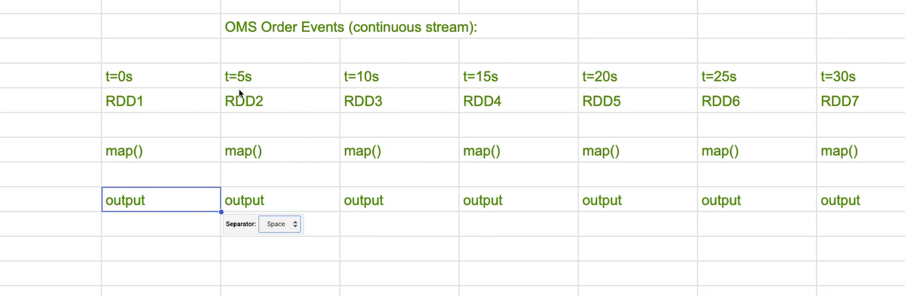

# Data Engineering – Spark Streaming (Class Notes)
# From Batch Processing to Real-Time Streaming with DStreams

## 1. The Story: Why Streaming Became Important

Imagine a large e-commerce company like Amazon.

Throughout the day, the **Order Management System (OMS)** continuously generates order events:

- Customer places order
- Payment processed
- Inventory updated
- Shipment triggered

These events happen **all day long**.

Earlier, companies used **batch processing** to analyze these orders.

### Batch Processing Workflow

1. OMS generates orders throughout the day.
2. Data is stored in storage (HDFS or database).
3. At midnight, the system loads the entire day's dataset into Spark.
4. Spark runs analytics on the complete dataset.
5. Results appear on dashboards the next day.

Example pipeline:

```

OMS Orders (All Day)
↓
Store Data in HDFS
↓
Midnight Spark Job
↓
Run Analysis
↓
Dashboard Updated (Next Day)

````

Problems with this approach:

- Analytics results arrive **very late**
- Decisions cannot be made in real time
- Fraud detection becomes difficult
- Inventory updates are delayed

Spark batch processing also works on **finite datasets**, meaning:


Spark knows the dataset size before processing begins.


For modern systems this delay is unacceptable.

Companies now want **near real-time insights**.

This leads to the concept of **Streaming Processing**.

---

# 2. Streaming Model

In streaming systems, data is processed **as soon as it arrives**.

Example streaming workflow:

1. OMS generates order events continuously.
2. Spark receives order events every few seconds.
3. Spark processes these small chunks of data.
4. Dashboards update continuously.

Example pipeline:


> OMS Orders (Continuous)
↓
Spark receives events every 5 seconds
↓
Micro-batch processing
↓
Dashboard updated
↓
Process repeats forever


Key idea:

Streaming processes an **unbounded dataset**.

This means:


Data never stops arriving.


Typical streaming latency:
5 seconds – 30 seconds


This is often called **Near Real Time (NRT)**.


---

# 3. Can We Use RDD for Streaming?

RDD is Spark's core abstraction for distributed data processing.

However, RDD is **not ideal for streaming applications**.

Reasons:

### 1. Manual Looping

If RDD is used for streaming, developers must write loops manually.

Example logic:


while(True):
read new data
process RDD


Spark does not automatically schedule processing.

---

### 2. Failure Handling Problems

If the script crashes during processing:

- We lose track of which data was processed
- We cannot easily resume processing

This creates reliability issues.

---

### 3. No Window Operations

Streaming systems often require **time-based computations**.

Examples:

- Total orders in the last 30 seconds
- Average revenue in the last 5 minutes
- Click count in the last hour

RDD cannot easily perform **window-based operations**.

---

### 4. Sequential Execution

RDD operations are sequential.

Example:
Batch 1 must finish before Batch 2 starts

This increases latency and reduces throughput.

---


# 4. Solution: DStreams (Discretized Streams)

To solve RDD streaming limitations, Spark introduced **DStreams**.

DStream stands for:

```

Discretized Stream

```

Definition:

A DStream is a **continuous sequence of RDDs**.

Spark automatically creates an RDD at regular intervals.

Example:

```

DStream
↓
[RDD for t=0–5 sec]
[RDD for t=5–10 sec]
[RDD for t=10–15 sec]
[RDD for t=15–20 sec]


Each RDD contains the data that arrived during that interval.

---
```

# 5. Automatic Transformation Execution

One powerful feature of DStreams is automatic transformation application.

Example:

If we define:

```

orders.map(...)
orders.filter(...)

```

Spark automatically applies the same transformation to **every micro-batch RDD**.

We do not need to write loops.

Example:

```

OMS Order Stream
↓
DStream
↓
[RDD Batch 1]
[RDD Batch 2]
[RDD Batch 3]
↓
Transformations automatically applied


This simplifies streaming pipeline development.

---
```

# 6. StreamingContext

Just like Spark uses **SparkContext**, streaming applications use **StreamingContext**.

StreamingContext sits **on top of SparkContext**.

Responsibilities:

- Receive streaming data
- Create micro-batch RDDs
- Schedule transformations
- Manage fault tolerance
- Maintain checkpointing

Architecture:

```

SparkSession
↓
SparkContext
↓
StreamingContext
↓
DStreams


---
```


# 7. Steps to Build a Spark Streaming Application

Typical workflow for building a streaming pipeline:

### Step 1 – Create Spark Session

Initialize Spark environment.

---

### Step 2 – Create SparkContext

SparkContext manages cluster resources.

---

### Step 3 – Create StreamingContext

Define batch duration.

Example:

```

StreamingContext(sc, batchDuration)

````

---

### Step 4 – Enable Checkpointing

Checkpointing ensures **fault tolerance**.

If the system fails, Spark can restart from the checkpoint.

---

### Step 5 – Define Streaming Source

Spark streaming can read data from multiple sources:

- HDFS directories
- Kafka topics
- TCP sockets
- File streams

---

### Step 6 – Apply Transformations

Transform streaming data using operations like:

- map
- filter
- reduceByKey

---

### Step 7 – Define Output

Output operations include:

- `pprint()`
- `foreachRDD()`

---

### Step 8 – Start Streaming

Start the streaming job.

---

# 8. Example Spark Streaming Implementation

### Step 1 – Create Spark Session

```python
from pyspark.sql import SparkSession
 
spark = SparkSession.builder \
   .appName("AmazonOrderStreaming") \
   .master("local[2]") \
   .config("spark.sql.shuffle.partitions", "4") \
   .getOrCreate()
 
spark.sparkContext.setLogLevel("ERROR")
sc = spark.sparkContext
````

---

### Step 2 – Import StreamingContext

```python
from pyspark.streaming import StreamingContext
```

---

### Step 3 – Create StreamingContext

Batch interval is set to **5 seconds**.

```python
ssc = StreamingContext(sc, batchDuration=5)
```

This means Spark will process incoming data every **5 seconds**.

---

### Step 4 – Enable Checkpointing

```python
ssc.checkpoint("/user/scltnrlab01/amazon_checkpoint_dir")
```

Checkpointing ensures fault tolerance.

---

### Step 5 – Define Streaming Source

Example: reading files from HDFS directory.

```python
lines = ssc.textFileStream("/user/scltnrlab01/7591b407-948e-4e77-b354-2856b7f49a2b")
```

Spark will process **any new file added to this directory**.

---

### Step 6 – Parse Order Data

Split CSV records.

```python
orders = lines.map(lambda line: line.split(","))
```

---

### Step 7 – Filter Delivered Orders

```python
delivered_orders = orders.filter(
    lambda col: col[7].strip() == "DELIVERED"
)
```

---

### Step 8 – Calculate Revenue by Category

```python
cat_revenue = delivered_orders.map(
    lambda col: (col[3].strip(), float(col[6]))
)
```

Example:

```
(category, revenue)
```

---

### Step 9 – Aggregate Revenue

```python
total_revenue_per_batch = cat_revenue.reduceByKey(lambda a, b: a + b)
```

---

### Step 10 – Print Output

```python
total_revenue_per_batch.pprint()
```

---

### Step 11 – Start Streaming

```python
ssc.start()
```

---

### Step 12 – Keep Application Running

```python
ssc.awaitTermination()
```

Streaming job continues running until manually stopped.

---

# 9. Example Streaming Data Pipeline

Complete architecture:

```
OMS Order Events
        ↓
Kafka / HDFS Stream
        ↓
Spark Streaming
        ↓
DStreams (Micro-batches)
        ↓
Transformations
        ↓
Aggregations
        ↓
Output Storage
        ↓
Dashboard / Analytics

---
```

# 10. Key Takeaways

Batch processing:

- Works on finite datasets
- Runs periodically
- High latency

Streaming processing:

- Works on continuous data
- Runs indefinitely
- Provides near real-time insights

DStreams solve streaming challenges by:

- Automatically creating micro-batch RDDs
- Applying transformations continuously
- Handling fault tolerance with checkpointing

Spark Streaming enables organizations to build **real-time data pipelines for analytics, monitoring, and event processing**.


----------------
----------------
-------------
---------------
---------------
-------------


batch vs streaming
OMs generated orders all day 
wait until midnight, load entire days's data into spark
run analysis 
takes 24 hrs
spark knows the dataset size 


streaming model
oms generates orders contineously 
spark recieves orders every 5 seconds
process mirco batch -> uspdate dashboard 
and the process is repeated forever.. and the latency is 5 to 30 seconds
spark processes an unbounded , never ending dataset


iis RDD a good option to use as a prat of streaming process


first we define the spark session 
then sc = spart context


why we should not use rrd in streaming
=> we wrtie the loop ourselves - no automatic scheduling
=> if the script crashes mid-loop , we loose track of progress 
=> no window operations(cant compute last 30 seconds easily)
=> sequenstial : batch 2 waits for batch 1 to fully completed


to solvw all these probelsm which rdd is giving we will uses Dstreams which is Discretized Stream
=> it is a contineous sequence of RDDs
for every N seconds (the batch interval) spark creates a new RDD from data that arrvied in that interval

D stream = [RDD at t=0.5] -> [RDD at t=5..10]->[RDD at t=10..15]->


when you applu map() or filter() to a Dstream, spark automatically  # applies that transfomration to every RDD in the sequence.

OMS order events (contineous stram)


if we apply the logic once the spark will apply the logic automatically
you never write a loop . you never manage individual rdds 
you define transfomation once on the Dstram , spark applies it to every RDD automatically


like we have a spark context .. here we have a streaming context 
it sits on top of sprark contect

receiving data from sournces
creating micro-batch  DS at regualr interval
Scheduling transfomation across executors
checkpointing state for fault tolerance

step 1 create a sparkContext
step 2 create StreamingContext(sc, batchDuration)
step 3 define checkpoint ssc.checkpoint => ssc is spark streaming context
step 4 define the streaming source  => text file stream, socketTextStream
step 5 apply transformations
step 6 define output => use pprint , foreachRDD


ssc.start() -> ssc.awaitTermination()  ssc.stop()


!hdfs dfs -mkdir amazon_structured_streams


from pyspark.sql import SparkSession
 
spark = SparkSession.builder \
   .appName("AmazonOrderStreaming") \
   .master("local[2]") \
   .config("spark.sql.shuffle.partitions", "4") \
   .getOrCreate()
 
spark.sparkContext.setLogLevel("ERROR")
sc = spark.sparkContext


from pyspark.streaming import StreamingContext


ssc = StreamingContext(sc, batchDuration=5)


ssc = StreamingContext(sc, batchDuration=5)


ssc.checkpoint("/user/scltnrlab01/amazon_checkpoint_dir")


lines = ssc.textFileStream("/user/scltnrlab01/7591b407-948e-4e77-b354-2856b7f49a2b")


orders = lines.map(lambda line: line.split(","))


delivered_orders = orders.filter(
    lambda col: col[7].strip() == "DELIVERED"
)
 
cat_revenue = delivered_orders.map(
    lambda col: (col[3].strip(), float(col[6]))
)


total_revenue_per_batch = cat_revenue.reduceByKey(lambda a, b: a + b)
total_revenue_per_batch.pprint()


ssc.start()


